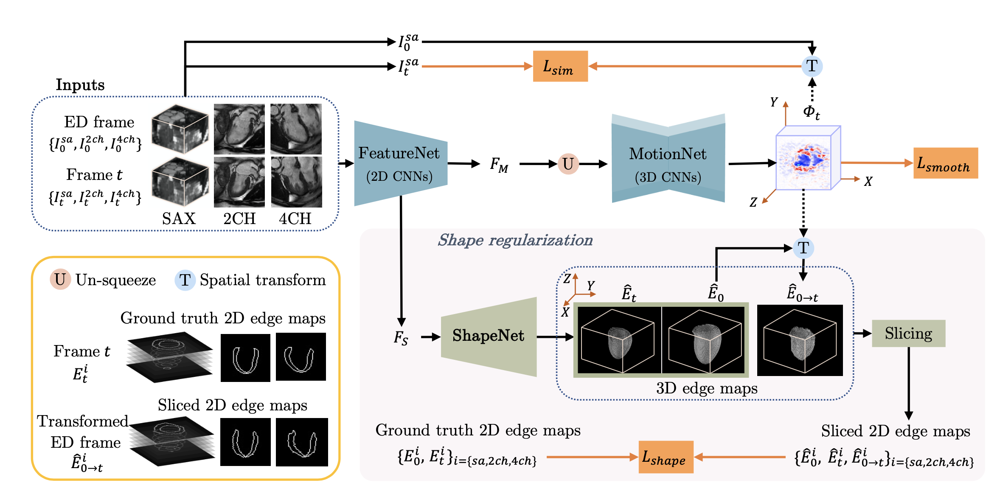

# Multiview-Motion-Estimation-for-3D-cardiac-motion-tracking
Code for paper ''MulViMotion: Shape-aware 3D Myocardial Motion Tracking from Multi-View Cardiac MRI' 


<p align="center">
    
</p>


# Citation and Acknowledgement

If you make use of the code, or if you found the code useful, please cite the paper in any resulting publications.
```
@article{Meng2022MulViMotion,
title = {MulViMotion: Shape-aware 3D Myocardial Motion Tracking from Multi-View Cardiac MRI},
journal = {IEEE Transactions on Medical Imaging},
year = {2022},
author = {Qingjie Meng and Chen Qin and Wenjia Bai and Tianrui Liu and Antonio de Marvao and Declan P O'Regan and Daniel Rueckert},
publisher = {IEEE},
}
```
